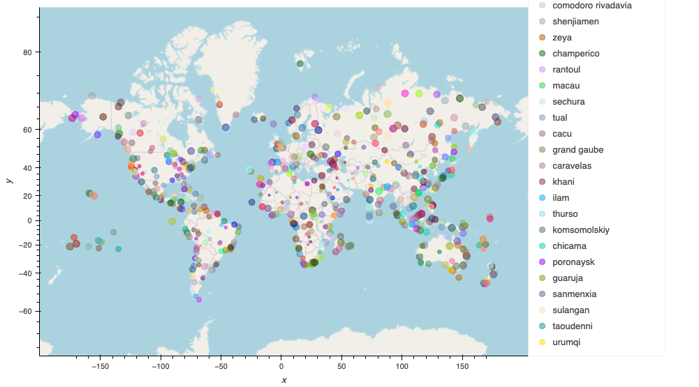
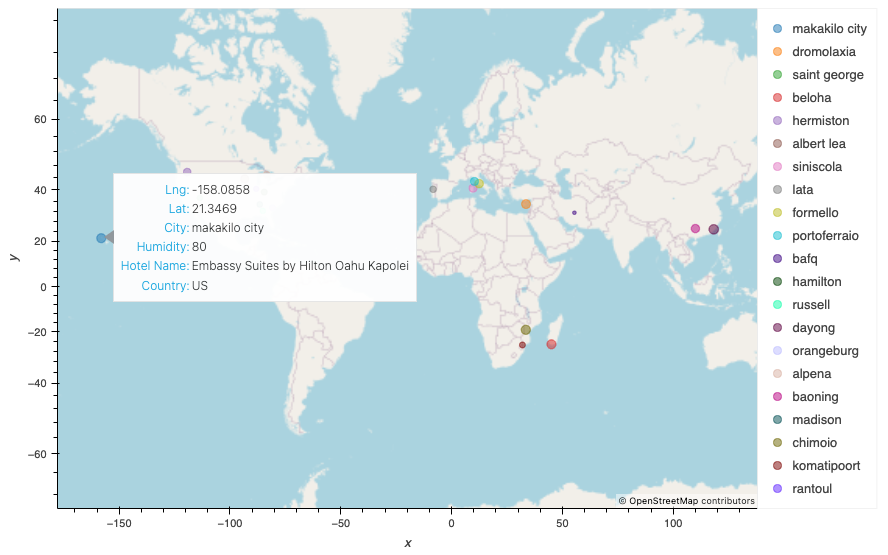

# -python-api-challenge
This challenge is about to analyse and answer a question: "What is the weather like as we approach the equator?"
 “That’s obvious. It gets hotter.” But, to prove that we will analyse the
the weather of over 500 cities of varying distances from the equator. We'll use the citipy Python library  and Python script to visualize the data. We will be using the OpenWeatherMap API https://openweathermap.org/api  to retrieve the weather data. 

Requirement 1: In this part we will Create Plots to Showcase the Relationship Between Weather Variables and Latitude
To fulfill the first requirement, we have used the OpenWeatherMap API to retrieve weather data from the cities list generated in the starter code. Next, we'll create a series of scatter plots to showcase the following relationships:

Latitude vs. Temperature

Latitude vs. Humidity

Latitude vs. Cloudiness

Latitude vs. Wind Speed

Requirement 2: Compute Linear Regression for Each Relationship and
create a series of scatter plots. Each scatter plot  includes the linear regression line, the model's formula, and the r values.

# Part 2: VacationPy

We used our weather data skills to plan future vacations. We also used Jupyter notebooks, the geoViews Python library, and the Geoapify API.

 A map visualization is created that displays a point for every city in the city_data_df DataFrame as shown in the following image. The size of the point is showing the humidity in each city.

Then we Narrow down the city_data_df DataFrame to find our ideal weather condition, for instance:

A max temperature lower than 27 degrees but higher than 21,Wind speed less than 4.5 m/s, Zero cloudiness...
a new DataFrame called hotel_df is created to store the city, country, coordinates, and humidity.
For each city, we use the Geoapify API to find the first hotel located within 10,000 meters of the coordinates. Another map visualization is displayed with showing the additional information of hotel name  and country in the hover message.

